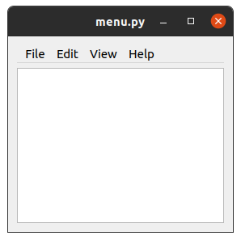
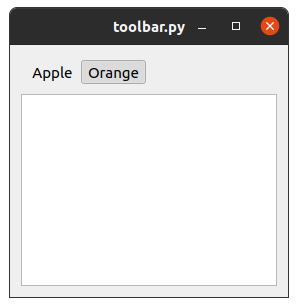
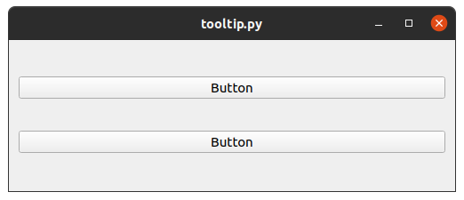
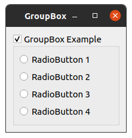
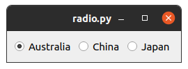
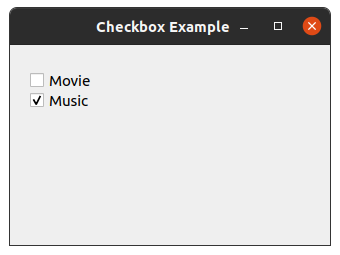
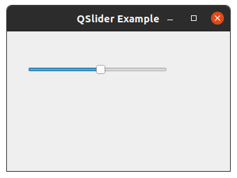
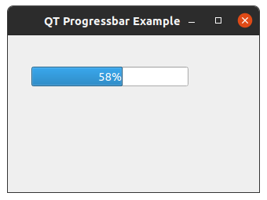

# Python GUI Programming use PyQt5

A collection of examples to quickstart Python GUI application with Qt.

## Preview

Hello world


Grid layout


Form layout


Horizontal layout


Vertical layout


Dialog


Calculator


Autocomplete


Tabs


Toolbox


Menu



Toolbar



Tooltip



Groupbox



Radio Button



Checkbox



Combobox


Slider



Show Image


Progress bar



## Setup PyQt5 Environment

We use anaconda to setup environment for develop Python GUI application.

Create conda env with this command:

```
conda create -n pygt5-env python=3
conda activate pygt5-env
conda install -c anaconda pyqt
conda deactivate
```

## QtCreator

QtCreator is a tool for create Qt UI quickly with drag & drop which provide by Qt company.

Install QtCreator on ubuntu

```shell
sudo apt install qtcreator
```

Start QtCrearor with this command

```shell
qtcreator
```

## Qt Designer

Install QT Designer on Ubuntu 18.04+

```shell
sudo apt-get install qttools5-dev-tools
sudo apt-get install qttools5-dev
```

Start Qt Designer

```shell
$ designer
```